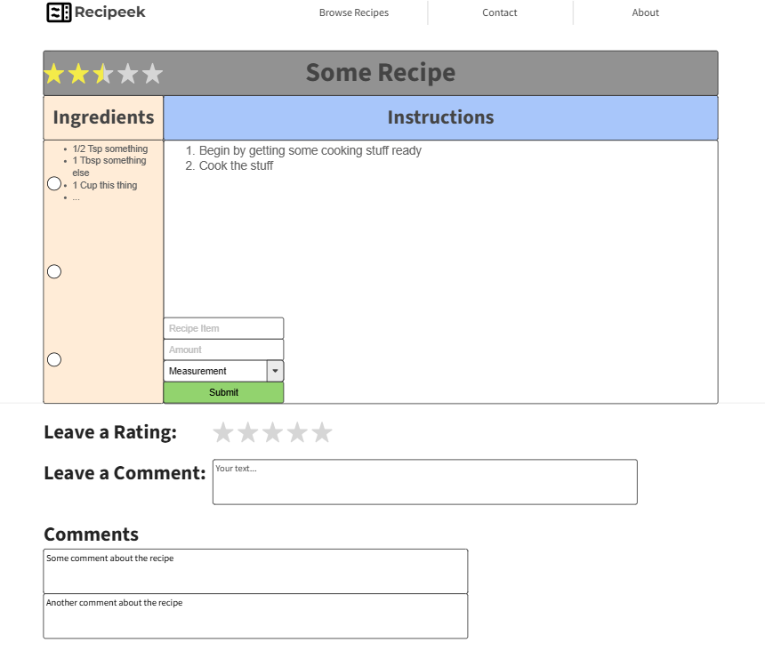

# Recipeek (CS408 Final Project)

Recipeek is a simple website designed to allow for users to upload their own custom recipes to a site to share with the world. It makes use of HTML, CSS, JavaScript, and an AWS backend to store the content used by the site.

## Project Specification
This section details the initial project specification broken into a few key sub-sections including the theme, what the site will do, the target audience, the data managed by the site, and the stretch goals.

### Theme
The general theme of this project is for the purpose of creating and sharing recipes. At the moment I'm mostly thinking about recipes for all types of food. The idea is to facilitate a community of people that share recipes that they have personally created or a family recipe that they wish to share with the rest of the world.

### What It Will Do
This website will be a place for users to post their recipes and possibly comment and review the recipes from other users. I think it could be beneficial for the comment and review options to be optional because I don't exactly want this to turn into some social media site, and it's possible that some people just want to post recipes to share with people close to them, but not to receive negative feedback.

### Target Audience
The target audience for this website are people that are interested in making new recipes, and family members to share recipes. The target audience will likely end up being quite broad as the need to make food is universal, and the recipes on the site can range from the simplest and cheapest options, to the most lavish and expensive. I think that targeting families would be a good use for the app because it could allow for a family to easily share their recipes with each other.

### Data Managed
At a basic level, I want the site to manage recipes that have been entered by different users, possibly user comments and reviews, and maybe user accounts with stats. As part of the recipe, I think that it would also be useful to allow the user the ability to enter tags that would describe the food. This could be used to implement future features such as a drop-down filter menu and search functionality. I doubt that I will be able to get to the point where I can implement user accounts and the search functionality, but I think the rest of items that I listed are achievable within the allotted time frame.

### Stretch Goals
As I briefly mentioned in the [data managed](#data-managed) section, the basic site will have the ability for users to post their own recipes, and I think a good next step would be to allow for users to also post comments and reviews for recipes. Adding user accounts is another stretch goal that I have, but I really doubt that I'll get to it because that is opening a whole can of worms. Another possible stretch goal would be to have a tag system that would allow for users to quickly navigate and possibly search for recipes that they would be interested in. I think that a basic tag system with a drop-down menu for some of the most common types of tags would be fairly straightforward to implement, but a full search feature may prove to be more difficult.

Another feature that would be useful would be some way to take a recipe and add it to a list of items thta you need to get at the store. I don't know if I would get to this functionality either because it's starting to exit the scope of the project and it could be a separate app by itself.

## Project Wireframe

